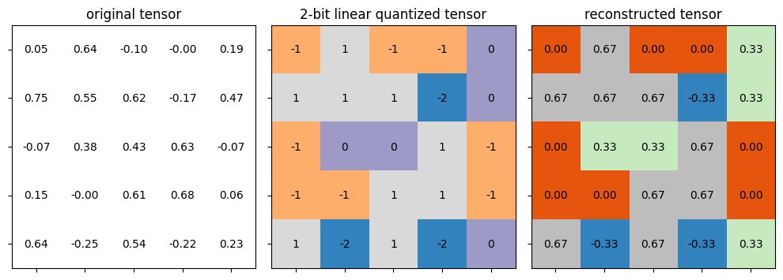
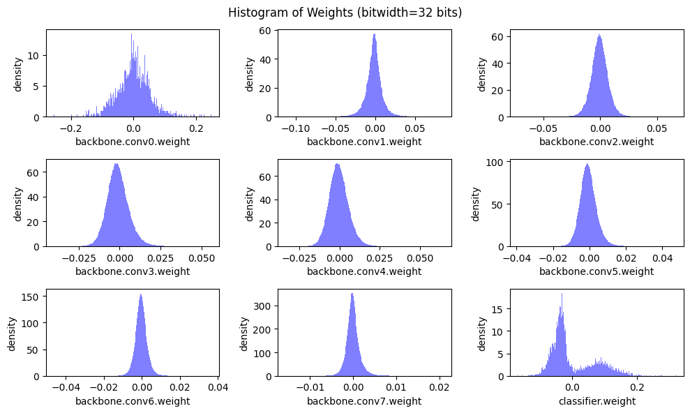
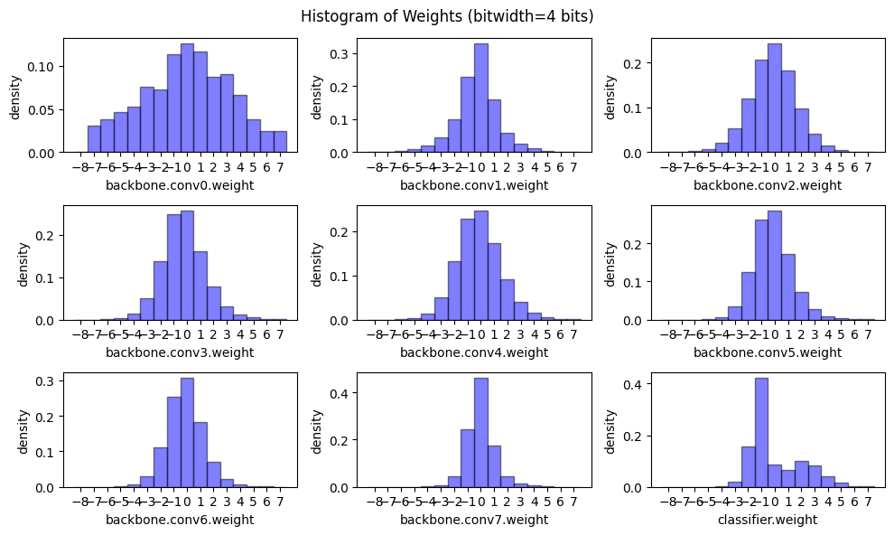
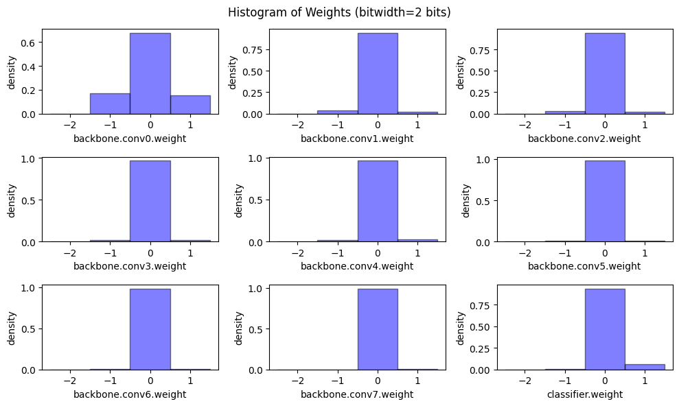
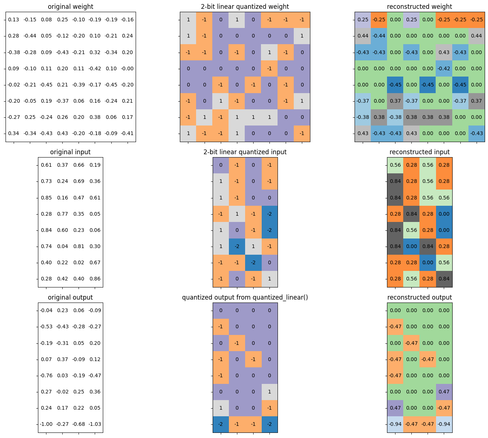

# Linear Quantization From Scratch: PyTorch Implementation

This repository implements linear quantization building blocks in PyTorch:
- toy tensors (what quantization actually does),
- per-channel weight quantization,
- a fully-quantized int8 fully-connected layer path (int8 multiply + int32 accumulate on CPU).

---

## What’s inside

- `quantization/linear.py`
  - signed integer ranges for *n*-bit quantization
  - linear quantization / dequantization helpers
  - scale + zero-point derivation
  - per-channel weight quantization
  - quantized bias + zero-point compensation
  - quantized fully-connected inference (`quantized_linear`)

- `models/vgg.py`
  - VGG-style CNN used by the demos (same structure as typical CIFAR-10 VGG variants)

- `scripts/`
  - reproducible demos that generate the exact figures used below

- `tests/`
  - pytest tests matching the reference tensors from the demo code

---

## Installation

```bash
python -m venv .venv
source .venv/bin/activate
pip install -r requirements.txt
```

---

## Assets (you already have these)

This README embeds **exactly five** images from `assets/`.  
If you re-generate them, use the scripts below to write the same filenames.

1) Linear quantization toy demo  
2) Weight histogram (fp32)  
3) Weight histogram (4-bit)  
4) Weight histogram (2-bit)  
5) Quantized fully-connected demo (original/quantized/reconstructed matrices)

---

## 1) Linear quantization on a toy tensor

Run:
```bash
python -m scripts.demo_linear_quantize --out assets/linear_quantize_demo.png
```

Expected console output:
```text
* Test linear_quantize()
    target bitwidth: 2 bits
        scale: 0.3333333333333333
        zero point: -1
* Test passed.
Saved: assets/linear_quantize_demo.png
```



---

## 2) Weight distribution (floating point)

Run:
```bash
python -m scripts.plot_weight_histograms --ckpt checkpoints/model_199-1.tar --bitwidth 32 --out assets/weight_hist_fp32.png
```



---

## 3) Per-channel linear quantization on weights (4-bit)

Run:
```bash
python -m scripts.peek_weight_quantization --ckpt checkpoints/model_199-1.tar --bitwidth 4 --out assets/weight_hist_4bit.png
```



---

## 4) Per-channel linear quantization on weights (2-bit)

Run:
```bash
python -m scripts.peek_weight_quantization --ckpt checkpoints/model_199-1.tar --bitwidth 2 --out assets/weight_hist_2bit.png
```



---

## 5) Quantized fully-connected layer demo (int8 path)

Run:
```bash
python -m scripts.demo_quantized_fc --out assets/quantized_fc_demo.png
```

Expected console output:
```text
* Test quantized_fc()
    target bitwidth: 2 bits
      batch size: 4
      input channels: 8
      output channels: 8
* Test passed.
Saved: assets/quantized_fc_demo.png
```



---

## Notes

- This repo focuses on the **core math and mechanics** of linear quantization (scale/zero-point, rounding, clamping, bias handling).
- Speedups depend on whether your runtime uses real integer kernels (CPU int8 works easily; GPU integer support varies by framework/version).
- Per-channel weight quantization typically improves accuracy vs per-tensor scales.

---

## References

- Jacob et al., 2018: *Quantization and Training of Neural Networks for Efficient Integer-Arithmetic-Only Inference*
- PyTorch documentation
